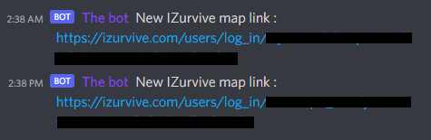
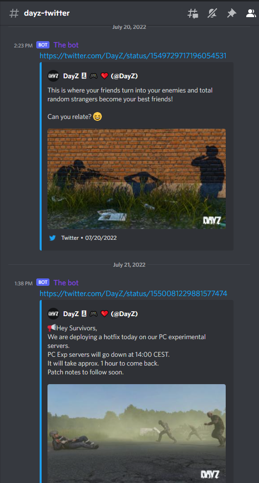

# Overview
A discord bot for DayZ game.

### IZurvive map connexion links
The bot will post a fresh [IZurvive](https://www.izurvive.com/) connexion link every 12 hours in the chosen channel.

### Follow DayZ Twitter account
The bot allows you to get all the tweets from [DayZ](https://twitter.com/DayZ) official account in a Discord channel of your choice.

# Install the project
Install nodejs and run `npm i` to install the required modules.

To provide the environment variables, just make a copy of the .env.template file and name it .env. Then you can complete it with your values.

**EMAIL_ADDRESS**: The e-mail address linked to the IZurvive account
 **EMAIL_PASSWORD**: The password for the e-mail address
 **EMAIL_HOST**: The host for the e-mail address imap server
 **EMAIL_PORT**: The port for the e-mail address imap server
 **DISCORD_BOT_TOKEN**: The discord bot token
 **IZURVIVE_LOGIN_CHANNEL_ID**: The channel id where the bot will post the IZurvive connexion links
 **TWITTER_CHANNEL_ID**: The channel id where the bot will post the DayZ tweets
 **TWITTER_API_KEY**: The Twitter API key
 **TWITTER_API_KEY_SECRET**: The Twitter API key's secret

# Start the bot
Create a bot on Discord and invite it on your server with the appropriate permissions.
The bot need to have the permissions to read and write on both of the channels (+ send embedded links for the Twitter one).

To start the application just run `node src/index.js`

# Bot usage

### IZurvive map connexion links
If you want to use IZurvive map with markers to share with your friends, you will need to connect to IZurvive.
The connexion process is a bit annoying since you may have to enter your mail address to receive a link by e-mail everyday.

To simplify this, every 12 hours the bot will connect to the e-mail address linked to IZurvive.
I advise to use a throwable e-mail address and IZurvive account for that and not your personal ones.

Everyone will use the same account and have access to all the groups of this account.
To protect it, I also recommend to post the links in a private channel where only the required person have access.

### Follow DayZ Twitter account

The bot will send all the DayZ tweets (as old as Twitter's APi allows us to get) and will post them on the chosen channel.
It's really useful to be alerted of the latest news, especially for updates, technical problems, servers down alerts and public servers/characters wipes.

The bot will check for new tweets every 15 minutes.

